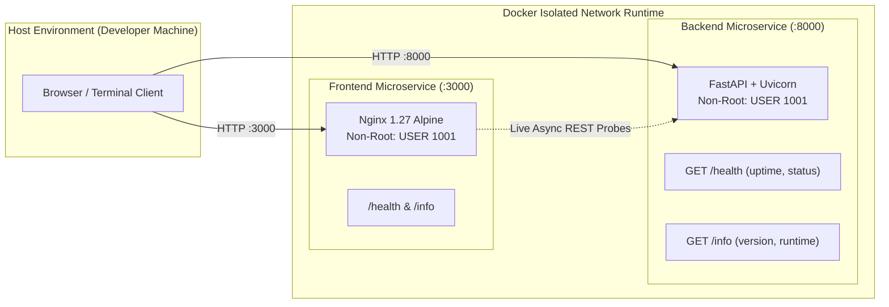

# Parallax DevOps Platform

[](https://www.parallaxlab.site/)
[](https://www.parallaxlab.site/)
[](#)

> **"Built different. Engineered better."**  
> A self-hosted enterprise infrastructure platform running entirely on local virtualization, engineered according to production-grade security, scalability, and 12-Factor principles.

---

## 📌 Week 1 Deliverable: Microservices & Containerization Foundation

This repository maintains the entire 6-week progressive infrastructure lifecycle, strictly honoring **The Single Repository Rule**.

### Weekly Milestone Objectives
- [x] **Verified Toolchain:** WSL2, Docker, kubectl, Helm, and Terraform validated and documented.
- [x] **Backend Microservice (`/services/backend`):** Production-grade Python FastAPI JSON API implementing standardized `/health` and `/info` endpoints.
- [x] **Frontend Microservice (`/services/frontend`):** Lightweight unprivileged Nginx HTTP server exposing an observability console and native `/health` / `/info` contracts.
- [x] **Container Hardening:** Multi-stage builds enforcing non-root execution (`USER 1001`), `.dockerignore` hygiene, and minimal base images.
- [x] **Local Verification:** End-to-end container execution, curl probe responses, and non-root security confirmation.

---

## 🏗️ Architecture & Service Contracts



### Microservice API Contracts

| Service | Endpoint | HTTP Method | Response Contract | Purpose |
|:---|:---|:---:|:---|:---|
| **Backend** | `/health` | `GET` | `{"status": "healthy", "service": "backend-service", "timestamp": "...", "uptime_seconds": ...}` | Liveness & readiness probe for orchestrators |
| **Backend** | `/info` | `GET` | `{"service": "backend-service", "version": "1.0.0", "framework": "FastAPI", "environment": "..."}` | Metadata discovery for Kong Gateway & Service Mesh |
| **Backend** | `/docs` | `GET` | Interactive OpenAPI Swagger UI | API specification and live debugging |
| **Frontend** | `/health` | `GET` | `{"status": "healthy", "service": "frontend-service", "timestamp": "..."}` | Web server availability probe |
| **Frontend** | `/info` | `GET` | `{"service": "frontend-service", "version": "1.0.0", "server": "Nginx Alpine", "environment": "..."}` | Static frontend runtime metadata |

---

## 📂 Repository File Architecture

```text
parallax-devops-platform/
├── services/
│   ├── backend/                      # Python FastAPI JSON API Microservice
│   │   ├── app/
│   │   │   ├── __init__.py
│   │   │   └── main.py               # Core application logic (/health & /info)
│   │   ├── Dockerfile                # Multi-stage, non-root (USER 1001) build
│   │   ├── .dockerignore             # Clean build context exclusion
│   │   └── requirements.txt          # Minimal production dependencies
│   │
│   └── frontend/                     # Lightweight HTTP Server Microservice
│       ├── src/
│       │   └── index.html            # Parallax Labs dark-mode dashboard
│       ├── nginx.conf                # Unprivileged non-root Nginx reverse-proxy
│       ├── Dockerfile                # Multi-stage, non-root (USER 1001) build
│       └── .dockerignore
│
├── README.md                         # Primary project documentation
└── .gitignore                        # Standard enterprise ignore rules
```

---

## 🚀 Reproducible Build & Run Instructions

To replicate and run the entire Week 1 containerized platform locally:

### 1. Build Multi-Stage Container Images
```bash
# Build Backend Microservice
docker build -t parallax-backend:v1.0.0 ./services/backend

# Build Frontend Microservice
docker build -t parallax-frontend:v1.0.0 ./services/frontend
```

### 2. Run Containers (Isolated Network)
```bash
# Run Backend API on Port 8000
docker run -d --name parallax-backend -p 8000:8000 parallax-backend:v1.0.0

# Run Frontend Server on Port 3000
docker run -d --name parallax-frontend -p 3000:3000 parallax-frontend:v1.0.0
```

### 3. Verify Running Processes
```bash
docker ps
```

---

## 🧪 Verification & Proof of Execution

### A. Non-Root Security Verification (`USER 1001`)
Both containers strictly enforce non-root execution for container escape mitigation:
```bash
docker exec parallax-backend id
# Output: uid=1001(appuser) gid=1001(appgroup) groups=1001(appgroup)

docker exec parallax-frontend id
# Output: uid=1001(appuser) gid=1001(appgroup) groups=1001(appgroup)
```

### B. Health & Info Probe Validation (curl)
```bash
# Backend Health Probe
curl -i http://localhost:8000/health
# HTTP/1.1 200 OK
# {"status":"healthy","service":"backend-service","timestamp":"...","uptime_seconds":209.28}

# Backend Metadata Probe
curl -i http://localhost:8000/info
# HTTP/1.1 200 OK
# {"service":"backend-service","version":"1.0.0","framework":"FastAPI","environment":"development","python_version":"3.11.17"}

# Frontend Health Probe
curl -i http://localhost:3000/health
# HTTP/1.1 200 OK
# {"status":"healthy","service":"frontend-service","timestamp":"..."}
```

### C. Live Observability Console
The frontend microservice provides a web-based dashboard at **`http://localhost:3000`** with real-time REST probe testing against the backend service.

---

## 🛠️ Verified Prerequisites & CLI Toolchain

All required local virtualization and DevOps CLI tools have been verified:

| Tool | Verified Version | Environment / Notes |
|:---|:---:|:---|
| **Docker Engine & CLI** | `v29.8.1` | Docker Desktop with WSL 2 Ubuntu backend integration |
| **kubectl** | `v1.36.1` | Kubernetes command-line interface |
| **Helm** | `v4.3.0` | Kubernetes package manager |
| **Terraform** | `v1.16.2` | Infrastructure as Code (IaC) provisioning tool |
| **Git** | `v2.55.0` | Distributed version control |
| **WSL 2** | Ubuntu | Windows Subsystem for Linux (Linux Kernel 5.15+) |

---

## 👤 Author
- **Engineer:** Bilgisayar Mühendisliği / DevOps Engineer Intern
- **Program:** Parallax Labs - Track B: 6-Week Standard Program
- **Repository:** [github.com/blosny/parallax-devops-platform](https://github.com/blosny/parallax-devops-platform)
